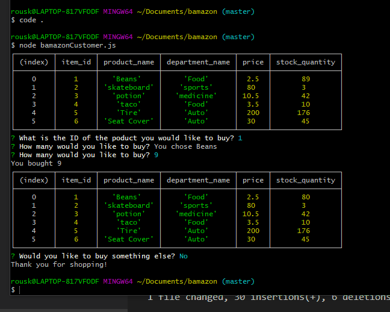

# bamazon
A console application that interacts with a mySQL database.

# Directions
If you would like to use this app yourself you must set up a mySQL database with names matching the column names in the gif below in a databse name of bamazon_db with a table called products, and add some data to it. If That is done right, run an npm init with node, and it should work as it does in the gif. when you run it in the console.

# Node Packages Used
* mysql
* inquirer

# Gif of applicication working 

# Direction for further development
* would like to remove the setTimeouts and organize my code in a better way with the async calls, by creating a better flow.
* create the next two features outlined in this assignment of having the option of being a manager or supervisor and have different functionality for each with different access to the database.
* possible find a better gui than using a console.table()
